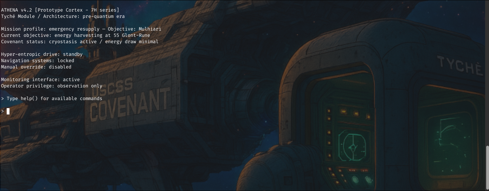

# 🚀 EventHorizon 3

**EventHorizon 3** is a Python sandbox challenge, specially crafted as the third and latest iteration for the [leHACK 2025](https://lehack.org/wargame-leaderboard-2025/) wargame CTF. Ultimately, it was solved by the top two teams during the event.

---

## 📌 Challenge Details

| | |
|---|---|
| **Category** | `Reverse Engineering` |
| **Tags** | `Python`, `Python Jail`, `Sandbox Escaping` |
| **Writeup** | [📄 WRITEUP.md](./WRITEUP.md) |
| **Solves** | 2 teams @ [`leHACK2025`](https://lehack.org/) |
| **Sources** | *Not provided* |

---

## 🛰️ Description

>  After narrowly escaping the gravitational grip of Gargantua, the USCSS Covenant now drifts powerless. Its reserves are depleted. The main systems have been placed in long-term standby, the crew in cryogenic sleep to conserve what little energy remains.
> 
>  Your only hope: the Tyché, a rescue module built in the earliest days of interstellar exploration. Outfitted with an experimental hyper-entropic propulsion system — a technology abandoned for its unpredictability — the Tyché must reach Mulhiari, a forgotten spaceport, erased from modern star charts.
> 
>  The onboard AI, ATHENA, bound to its original protocols, refuses to initiate the thrust required: by its calculations, it would exhaust the remaining resources and doom the rescue mission.
> 
>  Yet this is your sole chance: to reach the radiation of the dwarf star 55 Glont-Rune, and harness its energy for the journey to Mulhiari.
> 
>  Your only tool: a monitoring console, a relic from an age when quantum physics applied to space travel was still in its infancy.
> 
>  Perhaps a flaw. Perhaps your only way to regain control.

---

## 👤 Credits

Romain "Vorex" E Silva — [SysDream](https://sysdream.com)
