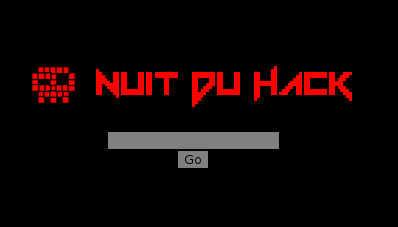
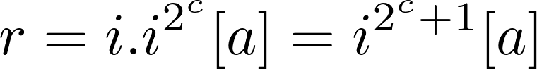
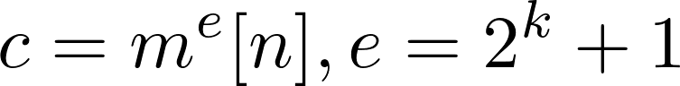
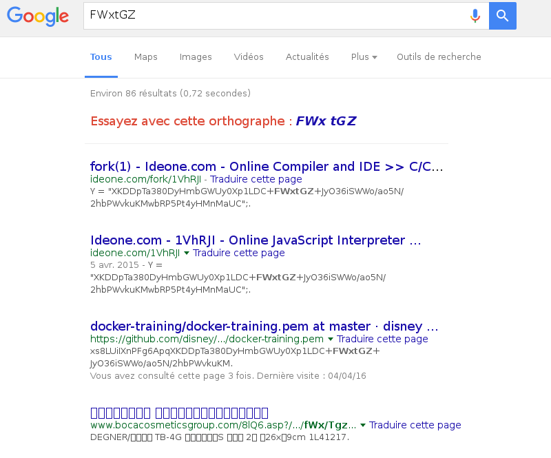
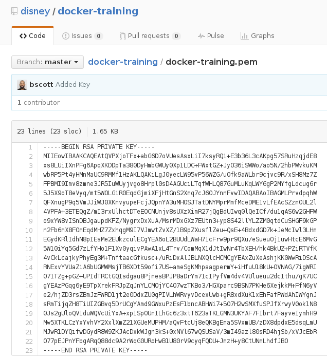
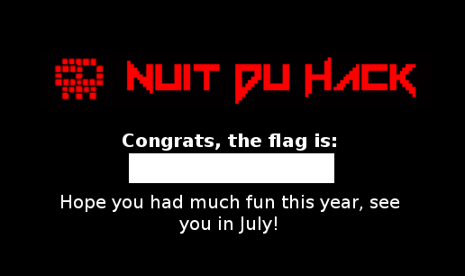

# NDH 2k16 "Mickey" challenge

**Category:** Crackme

**Points:** 0

**Description:**

Well, Nuit du Hack is back at Disneyland for an amazing 2016 edition. Just in case some of you make it to the top by solving all other challenges, here is some thought food for the night.

Of course, this challenge will not change scores or teams qualifications. However, if you solve it, please ping us whenever you are around Paris or during the Nuit du Hack, so we can offer you a drink.

We hope you had much fun this year. See you in July!


Writeup
=======

We access to the challenge at [http://static.quals.nuitduhack.com/mickey/](http://static.quals.nuitduhack.com/mickey/). The UI is minimalist and the goal quite obvious: finding the proper input.



After a quick look at the source code,(two libraries, JQuery and Big.js, apart), ``mickey.js`` seems like the only interesting file. Bindings are quite straightforward:

```
$(function() {
	$("#btn").click(function() {
		chk($("#wtf").val());
	})
});
```
The ``input`` value (``#wtf``) is checked by the ``chk`` function :

```
function chk(e) {
    if(btoi(atob(N+D+H+Z+V)).eq(enc(e))) window.location = "" + e + ".html";
}
```

When the conditions are met, the ``input`` value is used to build the URL for the final landing page. We avoid any brute-force and start focusing on the central condition:

```
btoi(atob(N+D+H+Z+V)).eq(enc(e))
```

After being processed by ``enc`` (maybe ``encode`` or ``encrypt``), ``e`` is compared with a constant. Remaining code requires some rewriting to be analyzed.

Constants ``G``, ``I``, ..., ``Z``, ``V`` are used exclusively to call ``atob`` (base64 to bytes), then ``btoi`` as in bytes to integer, which is confirmed by cleaning up the code (``y`` is declared as ``Big`` and ``o`` as ``256``):

```
function btoi(bytes){
    result = Big(0);
    for(index = 0; index < bytes.length; index++) {
      result = result.times(256).plus(bytes.charCodeAt(index));
    }
    return result;
}
```

We rewrite the remaining code after replacing each constant with its corresponding value:

```
a = Big(2285...949); // large integer
expected = Big(1138...051); // large integer

function it(i, j, k) {
    return i.times(i.times(k?1:j)).mod(a);
}

function enc(input) {
    i = Big(input);
    p = i.e;
    while(p) i=it(i,y(c),--p);
    return i;
}


function chk(input) {
    if(expected).eq(enc(input))) window.location = "" + input + ".html";
}
```

We can factor the calls to ``it`` and simplify the code, after noticing that ``k`` only evaluates as true during the last iteration.

```
function enc(input) {
    result = Big(input);
    count = result.e
    for(index = 0; index < count; index++) {
      result = result.times(result).mod(a)
    }
    result = result.times(Big(input)).mod(a)
    return result;
}
```

The result is squared multiple times. Because modulus is compatible with product, we get:



The typical RSA modular exponentiation (optimizing using squares and moduli is indeed very common with RSA). The public exponent is in the usual ``2^k+1`` form:



The ``enc`` function actually implements RSA with a public exponent of ``2^(i.e)+1`` (yet to be determined) and a modulus of ``a``. The input is encrypted without any padding and compared with the ``expected`` constant. In other words, RSA is used as a trapdoor function to build some kind of (poor) cryptographic hash function and check the input passphrase.

A look at the Big.js documentation shows that the ``e`` attribute stores the exponent in  decimal floating point format, which is roughly the number of digits in the number. By considering common RSA public exponent values, we may try:

 - ``e = 3``, where ``k = 1``, the input is basically a 1-digit number, which can be enumerated without success (such a small ``e`` would not act properly without padding anyway) ;
 - ``e = 65537``, where ``k = 16``, and brute-forcing becomes much less reasonable.

This is where the first hint comes in. After checking JPG comments inside the image:

```
» file Mickey1-Gunletsebgimfeg6.jpg
Mickey1-Gunletsebgimfeg6.jpg: JPEG image data, Exif standard: [TIFF image data, little-endian, direntries=1, manufacturer=HINT[log10(x) ~ 16]], baseline, precision 8, 1000x1000, frames 3
```

We confirm that ``e = 65537``. We thus have to decrypt the ``expected`` constant using RSA. However, ``a.e = 616``; with an approximate ratio of ``3.3``, modulus is 2048 bits longs, which is hard to attack. Small-factor attacks do not lead anywhere either.

This is where the second hint comes in eventually (it was actually already displayed in the source code): "Google Is Your Friend". There are a few well-known RSA-related Google dorks like ``"BEGIN RSA PRIVATE KEY"``.

Here, it is interesting to notice that base64-encoded DER private RSA keys contain a copy of the modulus. Because of the DER alignment, the base64 encoding produces the same output as when the integer is directly encoded.

Also,  ``/`` and ``+`` are sent in base64 and interpreted as word separators by Google indexation robots.
In fact, the base64 output offers multiple words that can be used to seek a modulus inside private RSA keys found in the wild.
Due to some alignment issues with fixed-width ASCII armored, we have to go through several attempts and errors before succeeding:





This is indeed the proper private key, hosted on a public Disney Github repository. We could also write a scripted dork to find out that not all of Alexa top 1M sites are safe against this kind of attack. Let's grab and decode the key:

```
» openssl rsa -in docker-training.pem -noout -text
Private-Key: (2048 bit)
modulus:
    00:b5:05:4f:5e:3a:13:17:1f:9a:6c:6e:83:ee:85:
		[...]
    c5:8c:7b:46:9d:2d:97:9a:ae:dc:27:a3:89:62:79:
    c5:bf
publicExponent: 65537 (0x10001)
privateExponent:
    63:0b:3e:bb:dd:a6:a8:56:40:55:e7:ba:03:fd:ab:
		[...]
    19:48:76:13:7c:a4:81:2c:31:ed:84:52:4c:dc:ba:
    51
```

And eventually decrypt the expected constant:

```
import base64

modulus = int("""
    00:b5:05:4f:5e:3a:13:17:1f:9a:6c:6e:83:ee:85:
    54:7a:c0:2c:c4:b8:88:ee:4b:32:45:08:be:13:76:
    f7:e8:bd:dc:00:aa:60:e7:b4:91:b8:7c:ea:8d:d1:
    3c:c6:cf:0b:52:22:17:9c:f1:60:e8:0a:6a:5c:a0:
    c3:a5:36:b7:f3:40:f2:1e:66:c6:59:4c:b4:5e:9d:
    4b:0c:2f:85:5b:1b:46:67:e2:72:3b:7e:a2:49:65:
    a8:fd:aa:39:37:fd:a1:6c:f5:af:92:e2:8c:c1:b4:
    4f:e4:fb:78:c8:73:27:31:a5:02:f5:13:0c:7f:51:
    f3:00:a2:d0:00:a8:8b:80:9d:32:79:c2:d6:f7:9b:
    cf:e7:a5:99:1b:fb:b4:7e:4f:5a:58:b6:eb:f5:c8:
    ef:73:d4:7f:c5:21:fc:33:3e:d9:14:f0:4c:23:d2:
    26:bf:cc:e6:9d:ed:c9:47:92:2e:59:4c:a3:be:0a:
    3c:1e:ba:65:d2:c0:f8:00:65:1c:88:b4:ea:7d:61:
    cb:43:ce:c6:b8:c2:ee:2a:a2:d6:63:a8:0f:d8:c6:
    1f:80:b7:5c:ba:0e:ab:e4:9e:57:f6:84:fc:79:5c:
    aa:fe:6b:79:58:e2:c6:89:1d:04:a9:d1:a3:9a:25:
    c5:8c:7b:46:9d:2d:97:9a:ae:dc:27:a3:89:62:79:
    c5:bf
""".replace(":", "").replace(" ", "").replace("\n", "")[2:], 16)

priv = int("""
    63:0b:3e:bb:dd:a6:a8:56:40:55:e7:ba:03:fd:ab:
    95:66:24:98:96:27:45:ca:9a:fc:ae:a5:e1:5c:8c:
    94:29:9d:80:37:b8:c1:ce:48:94:da:b4:33:58:32:
    9a:cc:99:f3:1c:78:33:04:d6:f2:df:10:07:12:67:
    39:b4:50:bd:a5:e1:53:c5:03:ed:c4:4c:44:20:67:
    f9:88:de:bc:54:96:17:2d:0d:37:84:38:23:54:9e:
    3b:fc:b1:45:f3:5e:29:91:db:b8:d0:80:17:54:23:
    0a:b4:95:07:88:09:ff:dd:bb:5a:80:4b:ac:36:18:
    71:56:a3:dc:58:5b:cb:c8:4a:70:c1:26:06:ae:a5:
    d2:85:67:f3:72:82:bc:43:c5:7b:80:fc:cb:2b:30:
    3c:46:5f:3e:c4:52:d9:f7:fb:2a:7c:4b:8d:a5:95:
    82:d9:64:cd:2a:b5:d0:ae:48:71:85:f6:41:8f:9f:
    61:5b:ea:65:fc:14:e9:84:a9:d3:07:67:b6:71:86:
    a8:0c:f4:8e:d5:26:6c:2d:66:f5:d9:ff:50:7d:a5:
    95:ee:b1:f9:59:7a:ef:90:b0:4f:b8:05:dc:5d:18:
    3e:e4:f8:97:8c:70:8c:25:dc:b1:e6:10:6c:9d:29:
    19:48:76:13:7c:a4:81:2c:31:ed:84:52:4c:dc:ba:
    51
""".replace(":", "").replace(" ", "").replace("\n", ""), 16)


crypto = int.from_bytes(base64.b64decode("""
WjGMm9Dku3HzPGy2iMSDr0YhDvvZuuPec1/DyEsm+l1nK8Rf8bjxpQO0inU2dxddtYpV+H06mMNA
LzF6hmdYMBzbhhELjjMSeUHFXGt5cBpdyk3GlcRIF4kDhzKvg6hdTS9aIpUIc0fPZjMaQSDOSOdK
xwrE0mrIxOA3H6KAd2+/NDT4zrAX8959dyJ/if2eaZsieAt3aO21oOh0qabC1Gh1Q9TNdCUHmlHv
SLe32E98JENnlI74apZhTtr/rWXJYMtPGnHW6QfZTN8WqqSMuYZ4KNl4tVleE9NTKWe8BEj8DajC
QXqvKnjpP3moa4tOe6VKo0xSRrB3xkXAb2FpCw==
""".replace("\n", "")), "big")

print(pow(crypto, priv, modulus))
```

```
» python exploit.py
46151943524651488
```

Here is the final landing page:


