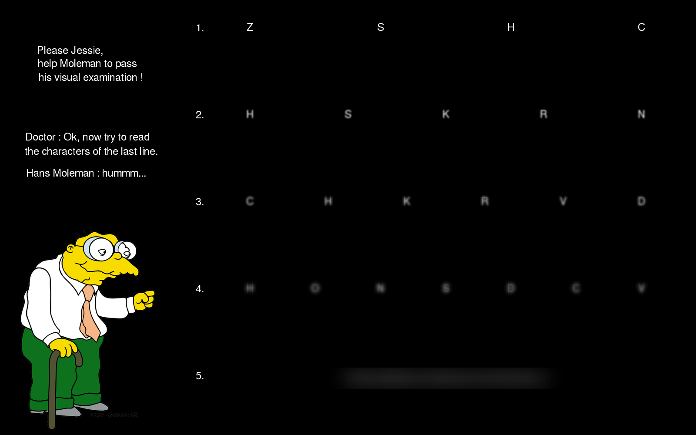
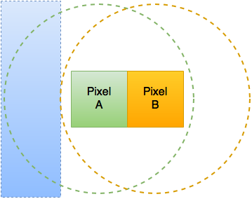
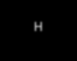
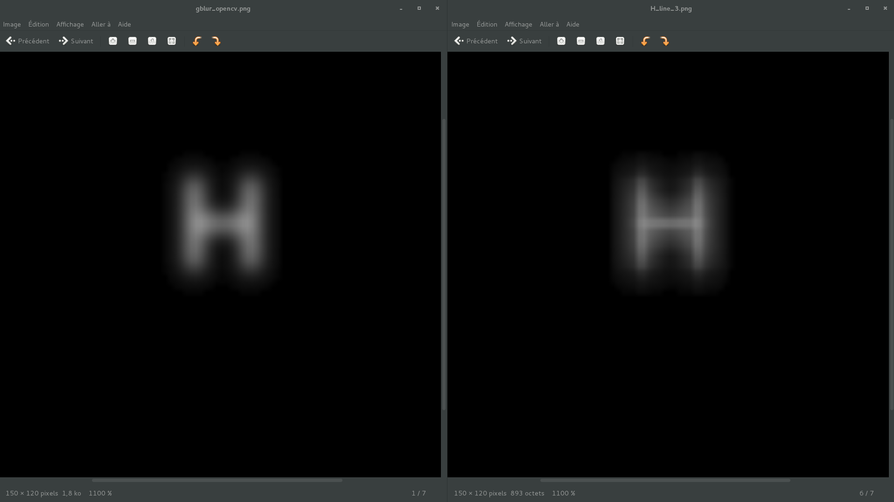
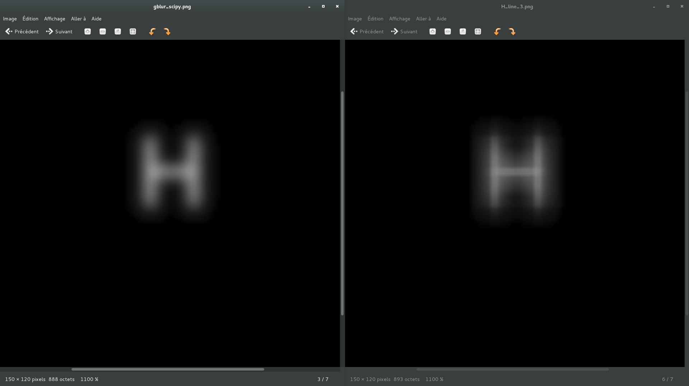
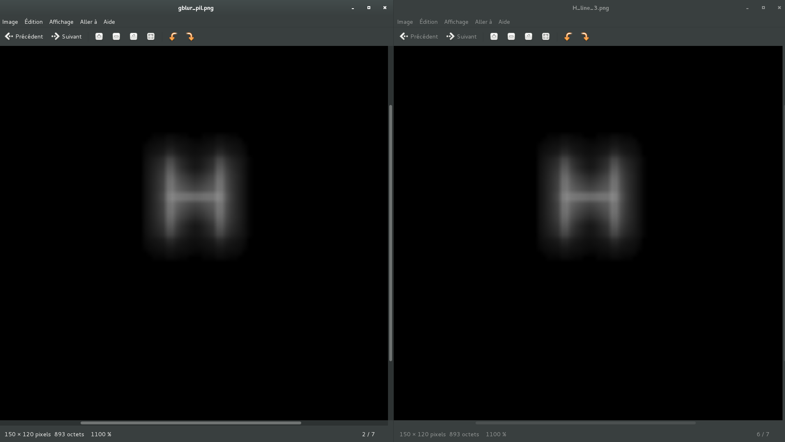
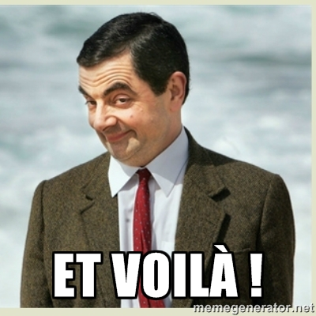

# NDH 2k16 "Moleman" challenge

**Category:** Steganography

**Points:** 500

**Description:**

Hi, my name is Hans Moleman,

The authorities want to withdraw my license just because "i'm too old".

But for god sake, I'm only 31 years old !

Please Jessie, help me to pass my visual exam.

> **Note that the flag format is : NDH[...]**



Observations
============

This challenge is composed of a PNG image in which the Doctor asks Moleman to read the fifth line.

Some information can also be retrieved from the observation of the image itself :

- We can see that the first line is composed of chars without any blur.

- Some kind of blur (likely a Gaussian blur) is used on the other lines (2, 3, 4 and 5).

- The blur radius seems to be larger for each line.

- The font and the text size seem to be the same everywhere.

- The first phrase refers to Jessie, so it might be important (the font, a specific behaviour, ...).

- The fifth line seems to contain the flag but it has been truncated at the top and bottom. Therefor, using a mathematical deconvolution in order to unblur the flag seems unlikely.

Furthermore, the challenge has likely been generated by some kind of script or program.
There isn't many popular libraries nor languages used for building images.

When you are processing images many people use C++ or python programs with libraries such as OpenCV, Numpy, PIL (or Pillow), SimpleCV ...

But for building quick and dirties images with simple manipulations like moleman.png, Python is the way to go.

Principle
=========

The blurred flag is partially truncated (top and bottom) but not the left part of it.
Thus, it should be enough to retrieve the flag.

Using a gaussian blur (even with a large radius) only affects a specific area around each pixel.



So, if a gaussian blur is applied to Pixel A and Pixel B, the blue area will only be defined by the Pixel A.

Applied to our blurred flag, it means that the left part of it is only defined by the first char of the string.

Even if the radius used to blur the flag is high. It should be enough to retrieve the first char.

Then, it should be possible to use this retrieved char in order to find the second character (as you would do with a padding oracle).

For example, imagine that our flag is this :


It should be possible to retrieve the original value if we are able to generate a char with the same position, font and blur.

Let's start with the char *B* :


The diff between the 2 images is :


The result isn't perfect, it may be because the first char of the flag is not *B*.

Now, let's try the same with the char *A* :


As we can see *A* is the right char, so the diff should give us a much better result :


Ok, now that we have retrieved the first char. Let's retrieve the second one.

To retrieve the second char, we will use the first one retrieved.

For example, in order to test the char *B* we will use the string *AB* :


And the diff will be :


By retrieving the best value for each char we may retrieve the blurred text.

> **Note : In order to successfully retrieve the flag, we have to know the font, the text size and the blur used.**

Prerequisites
=============

As said above, we must fulfill some prerequisites.

Jessie
------

The word *Jessie* may be an hint, especially if we need to find a font or the blur used (or both in our case).

Some fancy behaviours may be encountered between different distros, so to avoid them we will use *Jessie*, *Kali* or *Ubuntu* from now.

In order to use the above scripts you may need to install :

- OpenCV : apt-get install python-opencv
- FreeFont (Optionnal) : apt-get install ttf-freefont

Library
-------

For quick and dirties image manipulations Python is the way to go.

Let's test our hypothesis with the most common libraries : OpenCV, Numpy/SciPy and PIL.

### Control values #

First of all, we can see that the first line use chars without blur and a blur seems to be applied for each other line (stronger every time).

Secondly, we can see that the char *H* is present on each line.

It's perfect because we can use it in order to find the library used to generate the challenge.


We can indeed extract the *H* char from the first line, apply on it different blur functions from different libraries and compare the results with the others *H* chars from the others lines.

Using the script [char_extractor.py](scripts/char_extractor.py) we can retrieve 4 sub images :

- *H* char not blurred.


- The same char blurred with different radius.




It is now possible to blur the first image with different libraries and compare it with the others.

### OpenCV #

*OpenCV* is a well known library used by many people, so it is a logic start for our first try.

Using this script : [gblur_opencv.py](scripts/gblur_opencv.py)

We obtain a value that can be compared with the *H* char of the third line :



Sadly, the Gaussian blur implemented in *OpenCV* seems to act differently than the blur who have been used in *moleman.png*.

### SciPy #

Doing the same with *SciPy* ([gblur_scipy.py](scripts/gblur_scipy.py)) give us this result :



Again, using a standard use of the blur function give us a result pretty far from what is expected.

### PIL #

*PIL* is also a well known library used by many non-scientific projects.
It is well suited for quick and dirty image manipulations.

Using this script : [gblur_pil.py](scripts/gblur_pil.py)

We obtain a result that really looks alike our control value !



This time we have found the right library !

> **Note : For brievity, our examples are only for the main libraries.**

Font and text size
------------------

Our next task will be to find the font used for the text in *moleman.png*.

For that, we will use PIL in order to retrieve a character from *moleman.png*.

Then we will compare this character to the same character generated with different fonts and sizes.
In order to do so, OpenCV will be used.

The script [find_font.py](scripts/find_font.py) should be able to find the font and the text size used.

> **Note : It seems that every character use the same font and the same size.**

After using this script over many common fonts, we finally found the right one :

```
$ python find_font.py
[i] Retrieving a char not blurred
[i] Retrieving the font and size
Font : /usr/share/fonts/truetype/freefont/FreeSans.ttf; Text size : 24
```

It seems that the font used is [/usr/share/fonts/truetype/freefont/FreeSans.ttf](scripts/FreeSans.ttf) with a text size of *24*.

Blur
----

Our hypothesis is that the challenge has been generated using PIL, let's find if this hypothesis is the right one.

Now that we know the font and the text size, we can use this knowledge to adapt a little bit our previous script in order to test the different blur functions with various radius on a character of the second line.

After a few tries (with different blur functions), the script [try_gaussian_blur.py](scripts/try_gaussian_blur.py) worked :

```
$ python try_gaussian_blur.py
[i] Retrieving a char from the second line
[i] Finding the radius and the text position
RADIUS = 3, TEXT_POS = (66,99)
```

It seems that our hypothesis was right, PIL have been used to generate *moleman.png* with a Gaussian blur.

Exploit
=======

> **Note : In order to speed up the process, we used the fact that the flag was using the format NDH[...]. With this knowledge it is easier to find the starting point and the radius.**

Using the flag format trick and the information retrieved above, we can now extract the flag from *moleman.png*.

For this, we used the script [exploit.py](scripts/exploit.py)

```
$ python exploit.py
[i] Retrieving the flag area
[i] Finding the radius and the text position
RADIUS = 51, TEXT_POS = (145,11)
[i] Retrieving each char of the flag
[i] Take a break, it will take 5 mins without multithreading and some improvements (TODO)
1
b
d
0
0
b
b
1
a
8
1
b
9
e
2
c
b
1
9
c
f
c
3
0
f
4
c
f
0
5
a
1
]
FLAG = NDH[1bd00bb1a81b9e2cb19cfc30f4cf05a1]
```


